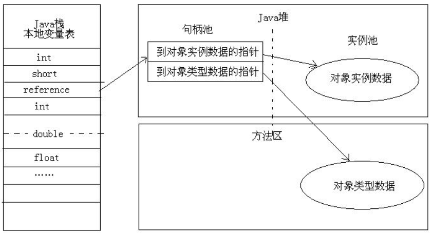
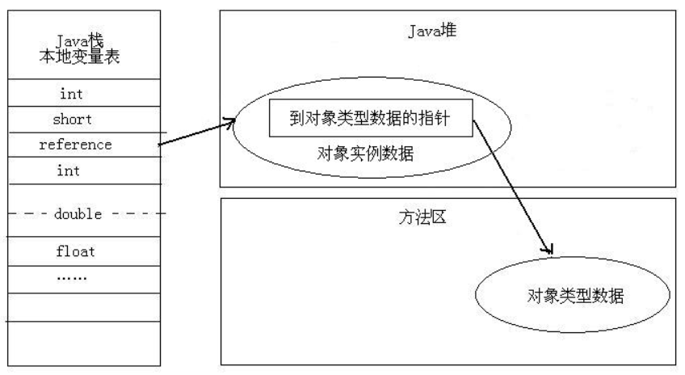

#### 常见问题

1. jvm内存区域划分及各部分的作用(1.8)？
   - 线程共享：
     - 堆：存放实例对象的地方，gc发生的主要区域
       - 年轻代
         - eden占比80%，from-survivor占比10%，to-survivor占比10%
       - 年老代
     - 元空间：1.8之后取代了1.7的方法区(永久代)
     - 直接内存：
   - 线程私有：
     - 虚拟机栈：存放局部变量表(八种基本数据类型数据和引用类型指针)，可能会出现StackOverFlowError和OutOfMemoryError错误
     - 本地方法栈：为虚拟机使用Native方法服务，可能会出现StackOverFlowError和OutOfMemoryError错误
     - 程序计数器：实现代码的流程控制，分支、循环、跳转、异常处理、线程恢复。

2. 对象的访问定位两种方式？

   - 句柄：在堆空间开辟一块空间作为句柄池，句柄池存放对象实例指针和对象类型指针，reference数据指针指针指向句柄
     - 好处：reference指针指向稳定的句柄，堆空间进行gc时，对象的位置移动只会改变句柄中的实例数据指针，对reference没有影响

   

   - 直接指针：堆中的实例对象来存放对象类型，reference数据指针指向实例对象

     - 好处：速度更快，节省一次指针定位的开销

     

3. Java对象的创建过程？
   1. 类加载检查：虚拟机遇到一条new指令，首先检查指令的参数能否在常量池中定位到这个类的符号引用，并检查这个类是否被加载、解析和初始化过，如果没有则执行类加载过程
   2. **分配内存**：对象所需内存大小在类加载完成后便可以确定，为对象在堆中划出一块对象大小的内存空间
      - 分配内存的两种方式：
        - **指针碰撞**：堆空间使用时是规整的，只许把分界点指针移动对象大小位置即可
        - **空闲列表**：堆空间使用时不是规整的，空闲区域维护在一个列表中，分配时先查询列表，分配完之后更新列表
        - 堆空间分配是否规整由所采用的的垃圾收集器的算法决定
      - 并发情况下内存空间的安全分配的两种方式(跟锁的安全策略其实差不多，原理上相同)：
        - **CAS失败重试，直至成功**
        - TLAB，预先为每个线程在eden区分配空间，jvm在线程中分配内存时首先在TLAB分配，TLAB剩余空间不足或用尽时，采用CAS失败重试继续进行内存分配
   3. 初始化零值：虚拟机需要将内存空间都初始化为零值，这一步操作保证对象实例字段在java中不经赋初始值即可使用
   4. 设置对象头：设置类的元数据信息、对象的哈希码、GC分代年龄。根据虚拟机当前运行状态的不同，决定是否启用偏向锁等
   5. 执行init方法：一般来说，执行`new`指令之后会接着执行`init`方法，把对象按照程序员的意愿进行初始化，这样一个真正可用的对象才算完全产生出来。