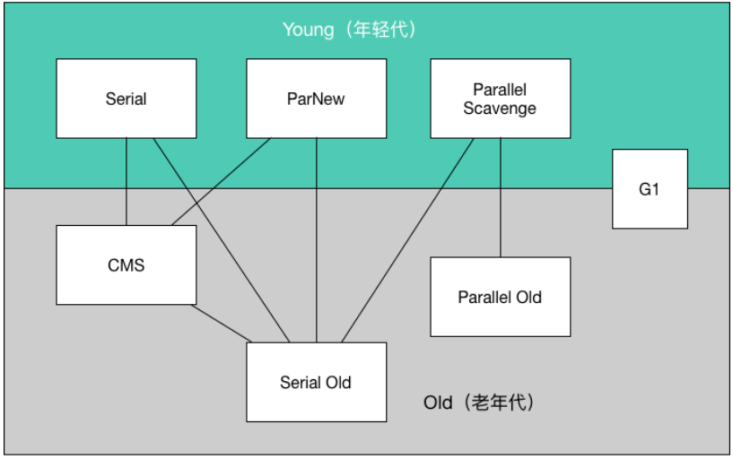
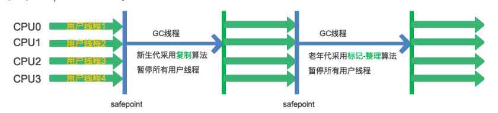

#### 常见问题

1. **堆空间的基本结构**？
   
   - 年轻代：eden区，survivor区(from和to)
   - 年老代
   
2. **堆内存常见的分配策略**？

   - 对象优先在eden区分配
   - 大对象直接进入年老代(连续空间的数组或列表)
   - 长期存活对象进入年老代

3. **如何判断对象已经废弃**？

   - 引用计数法：为对象添加计数器，有引用该对象的地方时，计数器+1
     - 优点：效率高，简单
     - 缺点：存在循环引用问题
   - 可达性分析算法：通过一系列GcRoots的对象为起点向下搜索，走过的路径为引用链，没在引用链上为废弃对象

4. **如何判定废弃常量和废弃类**

   - 废弃常量：jdk1.8之后常量在堆空间的常量池中，当没有任何引用变量引用该常量时，该常量就会被判定为废弃常量
   - 废弃类：需要满足三个条件
     - 堆空间没有该类对应的实例
     - 加载该类的ClassLoader已经被回收
     - 该类的`java.lang.Class`对象没有被引用，即无法通过反射等方法创建实例

5. **垃圾回收算法**

   - 标记清除算法：先标记再清除，有效率问题且会产生大量不连续的内存碎片
   - 标记整理算法：先标记，将标记数据移到内存一端，清除其余部分，有效率问题但不会产生内存碎片
   - 复制算法：将内存一份为二，使用一半内存，当垃圾回收时将存活对象放入另一半，然后清理自己的内存。好处是效率高且没有内存碎片，但会牺牲一半内存。在jvm中年轻代使用复制算法，但年轻代对象都是朝生夕死，所以内存分配时eden占用80%，而survivor占用%20来使用
   - 分代收集算法(常用)
     - 年轻代使用复制算法
     - 年老代使用标记清除或标记整理算法

6. **垃圾收集器**

   - Hotspot虚拟机的垃圾收集器

     

   - Serial收集器：串行收集器，使用单线程进行垃圾收集，当GC线程收集时，工作线程必须暂停(**stop the world**)直至收集结束，**年轻代使用复制算法，年老代使用标记整理算法**

     - 优点：**简单且高效**（与其他收集器的单线程相比），适合用在client端

     - 缺点：**stop the world**，用户体验差

       

   - ParNew收集器：Serial收集器的多线程版本，除了使用多线程进行垃圾收集外，其余行为都和Serial收集器一毛一样，**年轻代采用复制算法，年老代使用标记整理算法**，只有**Serial收集器和ParNew收集器**能与**CMS收集器**配合工作

   - Parallel Scavenge收集器：年轻代收集器，也是并行的多线程收集器，**年轻代使用复制算法，年老代使用标记整理算法**，唯一不同：**Parallel Scavenge收集器的关注点是高效利用CPU，即吞吐量(运行用户代码时间/(运行用户代码时间+垃圾收集时间))，而CMS的收集器关注的是用户线程的停顿时间(提高用户体验)**

   - Serial Old收集器：Serial收集器的年老代版本，主要有两大用途：一种用途是在Jdk1.5及以前版本与Parallel Scavenge收集器配合使用，另一种是作为CMS收集器的后备方案

   - Parallel Old收集器：**Parallel Scavenge收集器的年老代版本。**使用标记整理算法，注重吞吐量和CPU的高效利用

   - CMS收集器：