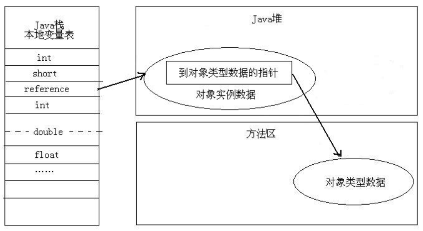

#### 常见问题

1. jvm内存区域划分及每一部分的作用(1.8)
   - 线程共享：
     - 堆：存放实例对象的地方，gc发生的主要区域
     - 元空间：
   - 线程私有：
     - 虚拟机栈：
     - 本地方法栈
     - 程序计数器

2. 对象的访问定位两种方式

   - 句柄：在堆空间开辟一块空间作为句柄池，句柄池存放对象实例指针和对象类型指针，reference数据指针指针指向句柄
     - 好处：reference指针指向稳定的句柄，堆空间进行gc时，对象的位置移动只会改变句柄中的实例数据指针，对reference没有影响

   

   - 直接指针：堆中的实例对象来存放对象类型，reference数据指针指向实例对象

     - 好处：速度更快，节省一次指针定位的开销

     

   