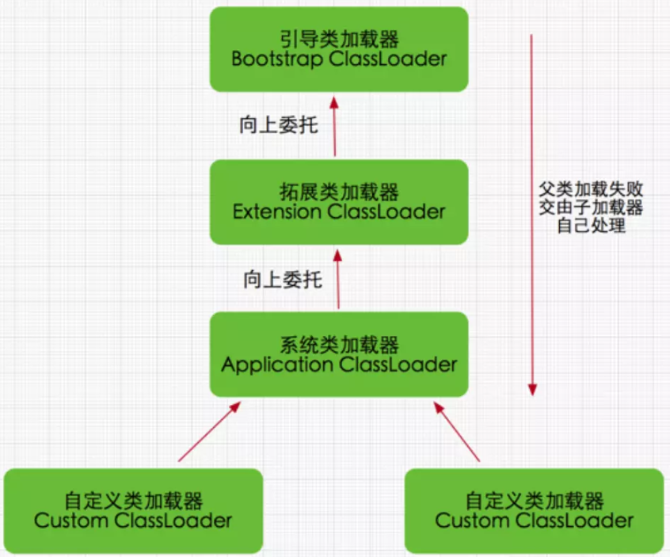

### 类加载器

JVM的内置了三个重要的类加载器，除了BootstrapClassLoader，其他类加载器都由java实现并继承自`java.lang.ClassLoader`

- **Bootstrap ClassLoader**：**启动类加载器**，最顶层的加载器，负责加载存放在`%JAVA_HOME%/lib`目录下的jar包或被`-Xbootclasspath`参数所指定的路径中的所有类
- **Extension ClassLoader**：**扩展类加载器**，主要加载目录`%JAVA_HOME%/lib/ext`目录下的jar包和类，或被`java.ext.dirs`系统变量所指定的路径中的所有类库
- **Application ClassLoader**：**系统类加载器**，负责用户类路径上所制定的类库

### 双亲委派模型

双亲委派模型要求**除了顶层的启动类加载器，其余的类加载器都应该有自己的父类加载器**，这里类加载器间的父子关系通过组合来实现

- 工作过程是：**如果一个类加载器收到类加载请求，会把这个请求扔给它的父类加载器处理，直至启动类加载器，如果父类加载器无法处理，则再向下返回给子类处理**

- 优势
  1. Java类随着它的类加载器一起具备了带有优先级的层次关系，也避免了类的重复加载
  2. 核心API库不会被随意篡改，比如你传入一个`Java.lang.Integer`的类给类加载器加载，这个类最终会被启动类加载器加载，启动类加载器检测到`Java.lang.Integer`已经加载，会直接返回已加载过的`Java.lang.Integer`