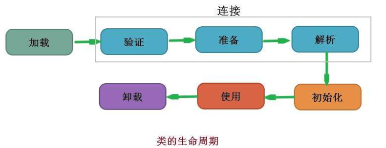

### 类加载过程

Class文件需要加载到虚拟机中才能运行使用，系统加载Class类型文件主要三步**加载->连接->初始化**，其中连接又可以拆分为**验证->准备->解析**

#### 加载

在加载阶段，虚拟机主要完成以下3件事：

1. **通过这个类的全限定名来获取定义此类的二进制字节流**
2. **将二进制字节流的静态数据结构转化为方法区的运行时数据结构**
3. **在内存中创建一个代表该类的 `java.lang.Class` 类型的对象，作为方法区这个类的各种数据的访问入口**

来对于类加载的其他过程，一个非数组类的加载过程（准确的说，是加载阶段中获取类的二进制字节流的动作）是开发人员可控性最强的，因为加载阶段即可以使用系统提供的引导类加载器来完成，也可以由用户自定义的类加载器去完成，而对于数组类而言，**数组类本身不通过类加载器创建，它是由Java虚拟机直接创建的**

#### 验证

1. 文件格式验证：验证字节流是否符合Class文件规范，是否以魔数0xCAFEBABE开头，主、次版本号是否在本虚拟机处理范围之内等等
2. 元数据验证：对字节码的描述信息进行语义分析，以保证其描述的信息符合Java语言的规范，如这个类是是否有父类，这个类的父类是否继承被final修饰的类等
3. 字节码验证：最复杂的一个阶段，主要目的是通过数据流和控制流分析，确定程序语义是合法的、符合逻辑的
4. 符号引用验证：确保解析动作能正确执行

#### 准备

**准备阶段是正式为类变量分配内存并设置变量初始值的阶段**，这些内存都在方法区中分配。对于该阶段有以下几点需要注意：

1. 这时进行内存分配的仅包括类变量（static），而不包括实例变量，实例变量在对象创建时一块分配到堆内存中
2. 这里设置的初始值通常为数据类型默认的零值（如0、0L、null、false等），比如我们定义了`public static int val = 111`，那么val变量在准备阶段初始值就是0而不是111（初始化阶段才会赋值）。特殊情况：比如给val变量加上了final关键字`public static final int val = 111`，那么准备阶段value的值就会被赋初值为111

基本数据类型的零值：

| 数据类型 |   零值   | 数据类型  | 零值  |
| :------: | :------: | :-------: | :---: |
|   int    |    0     |  boolean  | false |
|   long   |    0L    |   float   | 0.0f  |
|  short   | (short)0 |  double   | 0.0d  |
|   char   | '\u0000' | reference | null  |
|   byte   | (byte)0  |           |       |

#### 解析

解析阶段是虚拟机将常量池内的符号引用转换为直接引用的过程，解析动作主要针对类或接口、字段、类方法、接口方法、方法类型、方法句柄和调用限定符7类符号引用进行

符号引用就是一组符号来描述目标，可以使任何形式的字面量。直接饮用就是直接指向目标的指针、相对偏移量或是一个能间接定位到目标的句柄

解析阶段是虚拟机常量池的符号引用替换为直接引用的过程，也就是得到类或字段、方法在内存中的指针或偏移量

#### 初始化

初始化时类加载的最后一步，也是真正执行类中定义的Java程序代码，初始化阶段是执行类构造器`<client>()`方法的过程

对于`<client>()` 方法的调用，虚拟机会自己确保其在多线程环境中的安全性。因为 `<client>()` 方法是带锁线程安全，所以在多线程环境下进行类初始化的话可能会引起死锁，并且这种死锁很难被发现

对于初始化阶段，虚拟机严格规范了有且只有5种情况下，必须对类进行初始化：

1. 当遇到 new 、 getstatic、putstatic或invokestatic 这4条直接码指令时，比如 new 一个类，读取一个静态字段(未被 final 修饰)、或调用一个类的静态方法时。
2. 使用 `java.lang.reflect` 包的方法对类进行反射调用时 ，如果类没初始化，需要触发其初始化。
3. 初始化一个类，如果其父类还未初始化，则先触发该父类的初始化。
4. 当虚拟机启动时，用户需要定义一个要执行的主类 (包含 main 方法的那个类)，虚拟机会先初始化这个类
5. 当使用 JDK1.7 的动态动态语言时，如果一个 MethodHandle 实例的最后解析结构为 REF_getStatic、REF_putStatic、REF_invokeStatic、的方法句柄，并且这个句柄没有初始化，则需要先触发器初始化